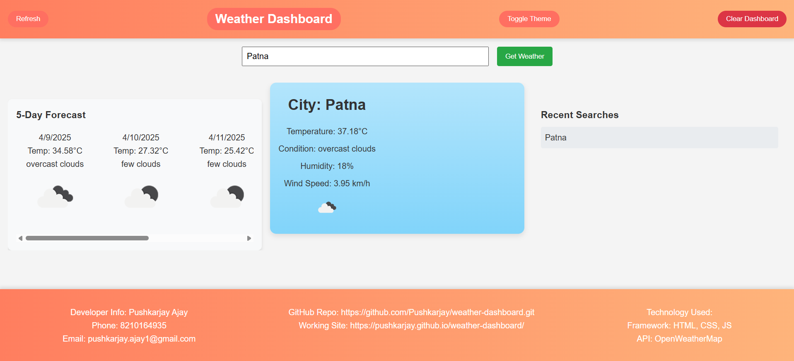
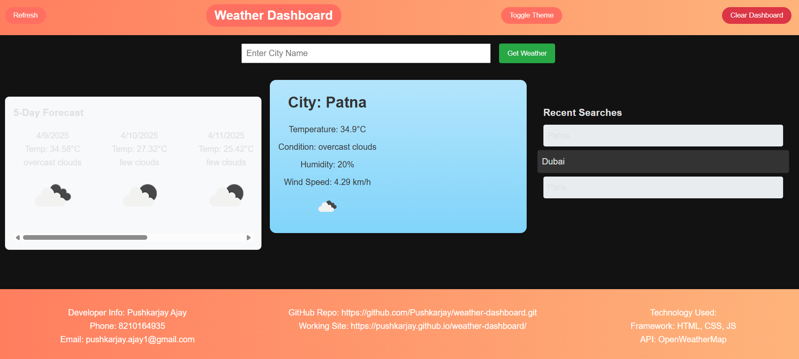
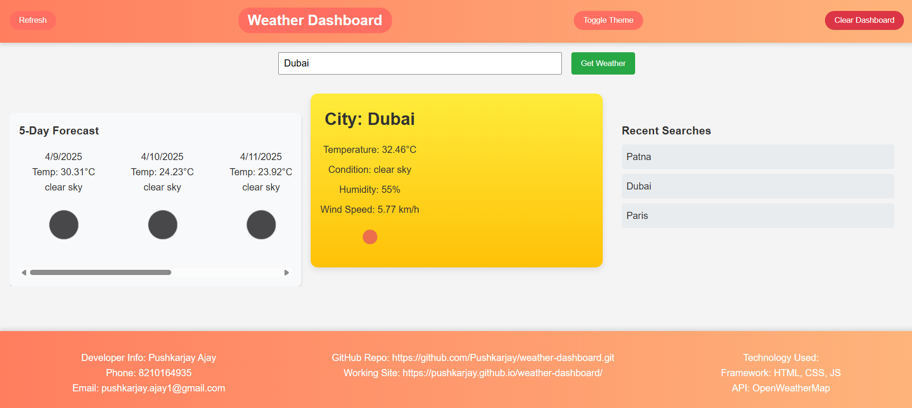

# Weather Dashboard

A responsive and interactive weather dashboard that provides current weather conditions, a 5-day forecast, and recent search history. The application uses the OpenWeatherMap API to fetch weather data and supports a dark theme for better usability.

## Features

- **Current Weather**: Displays the current temperature, weather condition, humidity, and wind speed for the searched city.
- **5-Day Forecast**: Provides a 5-day weather forecast with temperature, conditions, and icons.
- **Recent Searches**: Keeps track of the last 5 searched cities for quick access.
- **Dark Theme**: Toggle between light and dark themes for better readability.
- **Responsive Design**: Optimized for both desktop and mobile devices.
- **Three-Column Layout**: Divides the main section into three columns:
  - Left: Recent searches
  - Center: Weather card
  - Right: 5-day forecast

## Screenshots

### Light Theme


### Dark Theme


### History


## Technologies Used

- **Frontend**: HTML, CSS, JavaScript
- **API**: [OpenWeatherMap API](https://openweathermap.org/api)

## How to Use

1. Enter a city name in the search bar and click "Get Weather" or press Enter.
2. View the current weather and 5-day forecast for the city.
3. Toggle between light and dark themes using the "Toggle Theme" button.
4. Access recent searches by clicking on the city names in the "Recent Searches" section.
5. Use the "Refresh" button to reload the weather data for the last searched city.
6. Clear the dashboard and recent searches using the "Clear Dashboard" button.

## File Structure

```
e:\weather-dashboard\
│
├── index.html       # Main HTML file
├── style.css        # Stylesheet for the application
├── script.js        # JavaScript logic for fetching and displaying weather data
├── images/          # Folder containing screenshots
└── README.md        # Project documentation
```

## Developer Info

- **Name**: Pushkarjay Ajay
- **Phone**: 8210164935
- **Email**: pushkarjay.ajay1@gmail.com

## Links

- **GitHub Repository**: [Weather Dashboard Repo](https://github.com/Pushkarjay/weather-dashboard.git)
- **Live Demo**: [Weather Dashboard Live](https://pushkarjay.github.io/weather-dashboard/)
